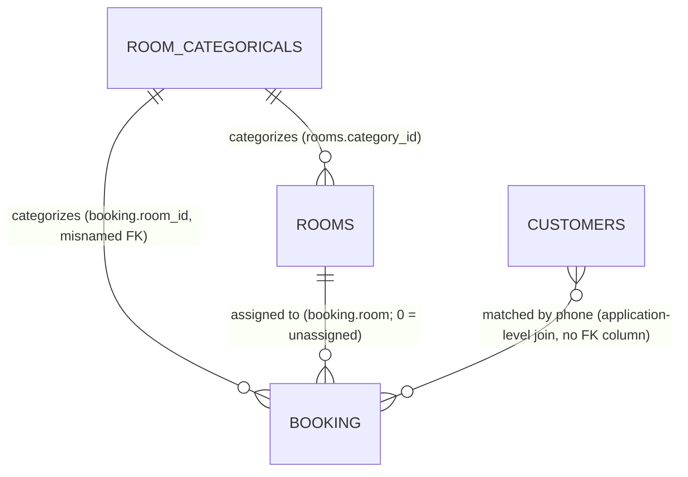

# Domain Model: Hotel-Management-System

**Path analyzed:** .
**Date analyzed:** 2026-09-08

## Entities

All five entities below correspond 1:1 to the five tables defined in `Data/myhotel.sql`. The collector's stack-specific fields (`type_declarations`, etc.) came back empty because this is a plain-PHP/SQL codebase, not a .NET-shaped one, so every field list below is anchored directly to the `CREATE TABLE` statements in `Data/myhotel.sql` plus the handler code that writes each column.

### Booking (`booking` table, `Data/myhotel.sql:30-47`)

Inference: The central transactional entity of the system — a single guest stay, from initial reservation through checkout and billing.

- `id` — primary key, auto-increment.
- `ref_no` (`int(20)`) — a randomly generated reference number shown to the guest. See DR-003.
- `name`, `mail`, `phone` — guest contact details captured at booking/check-in time (duplicated onto `customers` — see Relationships).
- `room_type` (`varchar(20)`) — free-text copy of the selected category name (e.g. "Single Room"), redundant with `room_id`/`room_categoricals.name`.
- `room_id` (`int(11)`) — **misleadingly named**: confirmed by reading `homepage/connect.php:32-38` and `admin/xulicheckin.php:21-27`, this column actually stores the **room category id** (a foreign key into `room_categoricals`, values 1/2/3), not a specific room's id.
- `room` (`int(20)`, default `0`) — the **actual specific room's id** (foreign key into `rooms.id`), assigned only once staff perform check-in (`admin/xulibooking.php:8`, `admin/xulicheckin.php:65`). `0` means "no specific room assigned yet."
- `adult`, `children` — occupant counts.
- `datein`, `dateout` — stay date range.
- `days_of_stay` — stated length of stay (not always recomputed consistently — see DR-009).
- `status` (`int(11)`) — lifecycle enum, see Enumerations.
- `message` (`text`, default `'None'`) — free-text guest note (e.g. special requests).
- `price` (`int(11)`, default `0`) — the amount charged at checkout (see DR-010).

### Customer (`customers` table, `Data/myhotel.sql:68-76`)

Inference: A running profile of every guest who has ever booked or checked in, deduplicated by phone number, that accumulates lifetime spend.

- `id` — primary key.
- `name`, `mail`, `phone`, `address` — contact details.
- `customer_id` (`int(20)`) — a randomly generated public-facing customer identifier, distinct from the internal `id`. See DR-004.
- `charges` (`int(11)`) — Inference: cumulative lifetime amount billed to this customer across all their checkouts. Confirmed incremented (never replaced) at checkout: `admin/xulicheckout.php:17-21`'s `UPDATE customers set charges = charges + ? where phone = ?`.

### Room (`rooms` table, `Data/myhotel.sql:96-101`)

Inference: A single physical, individually numbered hotel room belonging to one pricing category.

- `id` — primary key.
- `room` (`varchar(20)`) — the room's display name/number, e.g. `"Single_101"`.
- `category_id` (`int(3)`) — foreign key into `room_categoricals`.
- `status` (`int(2)`) — occupancy enum, see Enumerations.

### RoomCategory (`room_categoricals` table, `Data/myhotel.sql:122-126`)

Inference: A small, fixed set of room pricing tiers ("Single", "Double", "Deluxe") that rooms and bookings are classified under, rather than each room carrying its own independent price.

- `id` — primary key (seeded as exactly 1=Single Room, 2=Double Room, 3=Deluxe Room — `Data/myhotel.sql:132-135`).
- `name` (`varchar(20)`) — category display name.
- `price` (`int(30)`) — nightly rate for the category.

Named Gap: no admin screen was found anywhere under `admin/` that creates, edits, or deletes rows in `room_categoricals` — every reference to it in the codebase (`admin/manage_room.php:32-34`, `admin/manage_check_in.php`, `homepage/book.php:24-26`) is a **hardcoded** `<option>` list of exactly the three seeded categories, never a query-driven CRUD form. See functional-spec.md Named Gaps.

### User (`users` table, `Data/myhotel.sql:143-149`)

Inference: A staff/admin account used to authenticate into the back-office. Not linked to any other entity — it exists purely to gate `admin/` access.

- `id` — primary key.
- `name` — display name.
- `username` — login identifier.
- `password` (`varchar(10)`) — Field Semantics note: stored and compared as **plaintext**, confirmed by `admin/xuli_login.php:22,26` (`"...AND password='$pass'"`, then `$row['password'] === $pass`); the `varchar(10)` width is too narrow to ever hold a real password hash. This is already tracked as PQ-002 (open) rather than re-raised here.
- `type` (`int(2)`, default `2`) — role enum, see Enumerations.

## Relationships

**Narrative.**

- `ROOM_CATEGORICALS ||--o{ ROOMS` — every row in `rooms.category_id` (`Data/myhotel.sql:107-114`, e.g. rooms 1,2,5 all carry `category_id=1`) references `room_categoricals.id`; several rooms share one category, so this is a clean one-to-many.
- `ROOM_CATEGORICALS ||--o{ BOOKING` — `booking.room_id` is populated from the same three category ids (`homepage/connect.php:32-38`, `admin/xulicheckin.php:21-27`), confirming it is a category reference despite its name suggesting a link to `rooms`.
- `ROOMS ||--o{ BOOKING` — `booking.room` is set to a specific `rooms.id` value only at check-in time (`admin/xulibooking.php:8`: `UPDATE booking set status=1, room=? where id=?`; `admin/xulicheckin.php:59-63`'s insert binds `$rid` into the `room` column). Before check-in, `booking.room` is `0` (no opened file evidences a `rooms` row with `id=0`, so `0` functions as a sentinel "unassigned" rather than a real FK value) — flagged here rather than asserted as a strict foreign key.
- `CUSTOMERS }o--o{ BOOKING` — there is no `customer_id`/`customers.id` foreign-key column anywhere in `booking`. Every join between the two is done at the application level by matching `phone` values: `homepage/connect.php:48`, `admin/xulicheckin.php:71`, and `admin/xulicheckout.php:17` (`UPDATE customers set charges=... where phone=?`) all look up or update `customers` by `phone`, never by an id column. Rendered here as a plain many-to-many association rather than a real identifying relationship, since the code never enforces phone uniqueness at the database level (only best-effort, at insert time, in application logic — see DR-005).
- `User` carries no relationship edge to any other entity — confirmed by reading every file that touches `users`; the only cross-reference is `$_SESSION['login_type']`, which is session state, not a data relationship.

## Business Rules

<!-- DR-NNN IDs are permanent per Data/myhotel.sql and analyst-agent instructions. -->

1. **DR-001 — Login requires both a username and a password** — `admin/xuli_login.php:15-20`: submitting the login form with an empty username or empty password redirects back with `"Username is required"` / `"Password is required"` before any query runs.
2. **DR-002 — Login requires an exact single-row username+password match** — `admin/xuli_login.php:22-26`: `SELECT * FROM users WHERE username='$uname' AND password='$pass'` must return exactly one row (`mysqli_num_rows($result) === 1`), and that row's `username`/`password` must match exactly, or the login is rejected as "Incorrect username or password."
3. **DR-003 — Booking reference numbers are randomly generated and unique** — `homepage/connect.php:6-12`, `admin/xulicheckin.php:30-36`: `$ref = rand(0, 999999999)` is regenerated in a loop until no existing `booking.ref_no` matches it. Mechanical: the specific range `0–999999999` has no stated rationale in the code or comments.
4. **DR-004 — Customer ids are randomly generated and unique** — `homepage/connect.php:13-19`, `admin/xulicheckin.php:46-53`, `admin/xulicustomer.php:6-14`: `$cus_id = rand(0, 99999999)` is regenerated in a loop until no existing `customers.customer_id` matches it. Mechanical: range not explained.
5. **DR-005 — A new customer record is created only if no existing customer shares the same phone number** — `homepage/connect.php:48-55`, `admin/xulicheckin.php:71-78`: before inserting into `customers`, the code checks `SELECT * FROM customers where phone = '$phone'` and skips the insert if a row already exists. Inference: phone number is treated as the natural identity key for recognizing a returning guest, since no other identifier is collected from the public booking form.
6. **DR-006 — Room-type name maps to a fixed category id, defaulting to Deluxe for anything unrecognized** — `homepage/connect.php:32-38`, `admin/xulicheckin.php:21-27`: `"Single Room"` → 1, `"Double Room"` → 2, any other string (including the public form's unselected placeholder `"Type of Rooms"`, which carries no `value` attribute per `homepage/book.php:22-27`) → 3 (Deluxe). ⚠ PROVISIONAL — pending PQ-004 (proposed default: reject unrecognized/unselected room types instead of defaulting to Deluxe).
7. **DR-007 — Converting a pending booking to checked-in occupies the assigned room** — `admin/xulibooking.php:8-19`: sets `booking.status=1` and `booking.room=<chosen room id>`, then sets that room's `status=1` (unavailable). See the "Booking → Check-In Conversion" workflow in functional-spec.md for the full composite-call sequence.
8. **DR-008 — Walk-in check-in creates an already-checked-in booking and occupies the room** — `admin/xulicheckin.php:59-69`: inserts a new `booking` row directly with `status=1` (skipping the "booked" stage entirely) and sets the chosen room's `status=1`. See the "Walk-In Check-In" workflow.
9. **DR-009 — Days of stay is computed as the whole-day difference between check-in and check-out dates** — `admin/manage_check_out.php:15-16` (and identically in `admin/manage_booking.php:12-13`, `admin/manage_check_in.php:12-13`): `floor(abs(strtotime($dateout) - strtotime($datein)) / 86400)`.
10. **DR-010 — Checkout amount due is computed as category price × days of stay, but the charge actually recorded is unvalidated staff input** — `admin/manage_check_out.php:34-37` computes and displays `$cat['price'] * $calc_days`, enforced only via the HTML `min` attribute on the payment field; `admin/xulicheckout.php:3-16` writes whatever value arrives in `$_POST['payment']` straight into `booking.price` with no server-side comparison against the computed amount. ⚠ PROVISIONAL — pending PQ-005 (proposed default: enforce server-side that payment ≥ computed amount due).
11. **DR-011 — Checkout closes the booking, bills the customer, and frees the room in one composite operation** — `admin/xulicheckout.php:12-26`: `UPDATE booking set status=2, price=?`, then `UPDATE customers set charges = charges + ? where phone=?`, then `UPDATE rooms set status=0 where room=?`. See the "Guest Check-Out & Billing" workflow in functional-spec.md — this is a Composite-Flow Rule case: three distinct backend calls triggered by one "Payment & Check Out" button.
12. **DR-012 — Admin-only "Users" access is enforced only in the UI, not on the server** — `admin/sidebar.php:16-18` hides the "Users" nav link unless `$_SESSION['login_type'] == 1`; `admin/xuliuser.php` and `admin/delete_user.php`, read in full, contain no equivalent check, so any authenticated session (admin or staff) can reach those handlers directly. ⚠ PROVISIONAL — pending PQ-003 (proposed default: add a real server-side admin-only check).
13. **DR-013 — The edit-user form's Password field displays the user's id instead of their password** — `admin/manage_user.php:24`: `value="<?php echo isset($get['password']) ? $get['id'] : '' ?>"`. ⚠ PROVISIONAL — pending PQ-006 (proposed default: treat as a copy-paste defect, `$get['id']` should read `$get['password']`).

## Enumerations

1. **`booking.status`** (`Data/myhotel.sql:44`, comment `'0=booked, 1=check_in, 2=check_out'`) — values `0`, `1`, `2`.
   Inference: represents the stage of a guest's stay lifecycle — a reservation is made (`0`), the guest physically arrives and occupies a room (`1`), and the guest departs and is billed (`2`). Evidenced end-to-end by `homepage/connect.php` (inserts `status=0`), `admin/xulibooking.php`/`admin/xulicheckin.php` (`status=1`), and `admin/xulicheckout.php` (`status=2`).

2. **`rooms.status`** (`Data/myhotel.sql:100`, comment `'0=Available, 1=Unavailable'`) — values `0`, `1`.
   Inference: tracks whether a physical room can currently be assigned to a new stay. Set to `1` at check-in (`admin/xulibooking.php:14-18`, `admin/xulicheckin.php:65-69`) and reset to `0` at checkout (`admin/xulicheckout.php:22-25`).

3. **`users.type`** (`Data/myhotel.sql:148`, comment `'1 = admin, 2 = staff'`, default `2`) — values `1`, `2`.
   Inference: distinguishes an elevated "admin" role (able to see/manage user accounts, per `admin/sidebar.php:16`) from an ordinary "staff"/reception role. Note DR-012: this distinction is enforced only in UI visibility, not in the handlers themselves.
