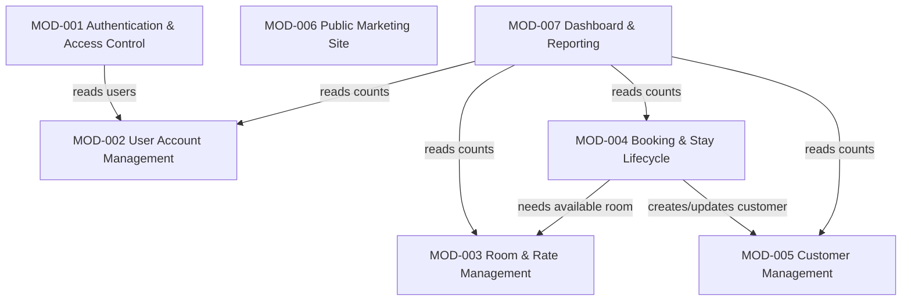

# Module Map: Hotel-Management-System

**Path analyzed:** .
**Date analyzed:** 2026-09-08
**Status:**  CONFIRMED by Hafsa, 09-09-2026

<!-- First-ever generation: module_map.present was false, next_mod_id MOD-001, no prior_modules[] roster to reconcile against. Every module below is newly minted. -->

## Modules

### MOD-001 — Authentication & Access Control

- **Purpose:** Gate the entire admin back office behind a login session, and carry the front-controller/layout infrastructure every other admin screen is reached through.
- **Owns (entities):** None.
- **References (not owned):** User (MOD-002) — reads `users` to verify login credentials but never writes it.
- **Services/routes:** `admin/login.php`, `admin/xuli_login.php`, `admin/logout.php`, `admin/index.php` (front controller / `?page=` router), `admin/sidebar.php` (session + role-visibility gate), `admin/header.php`.
- **Screens:** Login (`admin/login.php`).
- **Business rules:** DR-001, DR-002, DR-012.
- **Depends on:** MOD-002 (must read the `users` table MOD-002 owns to authenticate).
- **Backlog items:** not yet backlog-linked — rebuild-backlog.md does not exist yet.
- **Evidence:**
  - `admin/xuli_login.php:22-26` — credential-matching query and session-set logic (DR-001/DR-002).
  - `admin/index.php:16-21` — `$p = filter_input(INPUT_GET, 'page'); ... include $page . '.php'` front-controller dynamic include, already documented in `architecture.md`'s L3/L4 Front Controller & Layout component.
  - `admin/sidebar.php:4,16-18` — session gate (`isset($_SESSION['id']) && isset($_SESSION['username'])`) and the `login_type == 1` nav-visibility gate (DR-012).

### MOD-002 — User Account Management

- **Purpose:** Create, edit, and delete staff/admin login accounts.
- **Owns (entities):** User.
- **References (not owned):** None.
- **Services/routes:** `admin/users.php`, `admin/manage_user.php`, `admin/xuliuser.php`, `admin/delete_user.php`.
- **Screens:** User list (`admin/users.php`), Create/Edit User modal (`admin/manage_user.php`).
- **Business rules:** DR-012 (co-owned with MOD-001: MOD-001 owns the visibility-gate rule's enforcement point, MOD-002 owns the handlers the rule says should — but currently don't — check role server-side), DR-013.
- **Depends on:** MOD-001 (a session must exist to reach these screens at all, per the front-controller's session gate).
- **Backlog items:** not yet backlog-linked — rebuild-backlog.md does not exist yet.
- **Evidence:**
  - `admin/xuliuser.php` (full file) and `admin/delete_user.php` (full file) — both read in this run; neither references `$_SESSION['login_type']`, confirming DR-012's enforcement gap sits in this module's handlers.
  - `admin/manage_user.php:24` — the password/id pre-fill bug (DR-013).

### MOD-003 — Room & Rate Management

- **Purpose:** Maintain the hotel's physical room inventory and (nominally) its pricing categories.
- **Owns (entities):** Room, RoomCategory.
- **References (not owned):** None.
- **Services/routes:** `admin/rooms.php`, `admin/manage_room.php`, `admin/xulideleteroom.php` (create/update handler, despite its name), `admin/delete_room.php`.
- **Screens:** Room list (`admin/rooms.php`), Create/Edit Room modal (`admin/manage_room.php`).
- **Business rules:** None owned outright (the `rooms.status` enum's meaning is documented in domain-model.md's Enumerations, but the status is written by MOD-004's flows, not by this module's own handlers).
- **Depends on:** None.
- **Backlog items:** not yet backlog-linked — rebuild-backlog.md does not exist yet.
- **Evidence:**
  - `admin/manage_room.php:23-45` and `admin/xulideleteroom.php` (full file) — Room CRUD.
  - `Data/myhotel.sql:96-135` — `rooms`/`room_categoricals` table definitions and seed data confirming the category-tier design.
  - No file in scope was found that creates/edits/deletes a `room_categoricals` row — see functional-spec.md's Named Gaps; RoomCategory is included in this module's ownership as the closest-fitting entity home, since `rooms.category_id` is this module's own foreign key, even though no live management screen for it exists.

### MOD-004 — Booking & Stay Lifecycle

- **Purpose:** Own the guest reservation end-to-end — public intake, front-desk check-in (from a prior booking or walk-in), and checkout/billing — since all three stages are sequential status transitions on the same `booking` row (per `codebase-report.md`'s Domain section and DR-007/DR-008/DR-011).
- **Owns (entities):** Booking.
- **References (not owned):** Room (MOD-003) — reads availability and writes `rooms.status` at check-in/checkout; RoomCategory (MOD-003) — reads category id/price for classification and billing; Customer (MOD-005) — reads/writes by phone match at booking, check-in, and checkout time.
- **Services/routes:** `homepage/book.php`, `homepage/connect.php` (public intake); `admin/booked.php`, `admin/manage_booking.php`, `admin/xulibooking.php`, `admin/delete_booking.php` (booking→check-in conversion, cancellation); `admin/check_in.php`, `admin/manage_check_in.php`, `admin/xulicheckin.php` (walk-in check-in); `admin/check_out.php`, `admin/manage_check_out.php`, `admin/xulicheckout.php`, `admin/view_check_out.php`, `admin/edit_check_in.php`, `admin/xulieditcheckin.php` (checkout, view, edit).
- **Screens:** Reservation form (`homepage/book.php`), Pending Bookings (`admin/booked.php`), Booking Check-In modal (`admin/manage_booking.php`), Walk-In Availability (`admin/check_in.php`), Walk-In Check-In modal (`admin/manage_check_in.php`), Check-In/Out list (`admin/check_out.php`), Checkout modal (`admin/manage_check_out.php`), Stay Detail (`admin/view_check_out.php`), Edit Checkout Date modal (`admin/edit_check_in.php`).
- **Business rules:** DR-003, DR-004, DR-005 (co-owned with MOD-005: this module triggers the dedup, MOD-005 owns the `customers` row itself), DR-006, DR-007, DR-008, DR-009, DR-010, DR-011.
- **Depends on:** MOD-003 (needs an available room to assign), MOD-005 (creates/updates the matching customer record as a side effect of booking/check-in/checkout).
- **Backlog items:** not yet backlog-linked — rebuild-backlog.md does not exist yet.
- **Evidence:**
  - `homepage/connect.php` (full file), `admin/xulibooking.php` (full file), `admin/xulicheckin.php` (full file), `admin/xulicheckout.php` (full file), `admin/xulieditcheckin.php` (full file) — all read in this run; each writes to `booking` and progresses `status` per DR-007/DR-008/DR-011.
  - `codebase-report.md`'s Domain section: "a guest books via the public site, and staff progress that booking through check-in and check-out" — the stated rationale for keeping these three stages as one module rather than three.

### MOD-005 — Customer Management

- **Purpose:** Maintain the guest/customer directory and lifetime billing history.
- **Owns (entities):** Customer.
- **References (not owned):** None.
- **Services/routes:** `admin/customers.php`, `admin/manage_customer.php`, `admin/xulicustomer.php`, `admin/delete_customer.php`.
- **Screens:** Customer list (`admin/customers.php`), Create/Edit Customer modal (`admin/manage_customer.php`).
- **Business rules:** DR-004 (co-owned with MOD-004: this module's own create-customer handler, `admin/xulicustomer.php`, independently regenerates a unique `customer_id` the same way MOD-004's flows do), DR-005 (co-owned with MOD-004: `admin/xulicustomer.php:29` runs its own phone-match check before INSERT, the same guard MOD-004's `admin/xulicheckin.php:71` applies).
- **Depends on:** None.
- **Backlog items:** not yet backlog-linked — rebuild-backlog.md does not exist yet.
- **Evidence:**
  - `admin/xulicustomer.php` (full file) — customer CRUD including its own DR-004-shaped unique-id generation loop.
  - `admin/manage_customer.php` (full file) — the create/edit form.

### MOD-006 — Public Marketing Site

- **Purpose:** Present read-only marketing content (rooms, services, food) to anonymous visitors and route them toward the reservation form.
- **Owns (entities):** None.
- **References (not owned):** None — the room prices shown here are hardcoded static text, not a live query against RoomCategory (MOD-003); see functional-spec.md's Named Gaps for why no reference edge is asserted.
- **Services/routes:** `homepage/index.php`, `homepage/room.php`, `homepage/service.php`, `homepage/food.php`, `homepage/Header.php`, `homepage/footer.php`.
- **Screens:** Home (`homepage/index.php`), Room Details (`homepage/room.php`), Services (`homepage/service.php`), Food & Drinks (`homepage/food.php`).
- **Business rules:** None.
- **Depends on:** None.
- **Backlog items:** not yet backlog-linked — rebuild-backlog.md does not exist yet.
- **Evidence:**
  - `homepage/index.php`, `homepage/room.php`, `homepage/service.php`, `homepage/food.php` (all read in full) — no database query in any of them; prices/content are static markup.

### MOD-007 — Dashboard & Reporting

- **Purpose:** Give staff a single at-a-glance read-only view of key counts and totals across every other module's data.
- **Owns (entities):** None.
- **References (not owned):** Booking (MOD-004) — booking/checkin/checkout/payment counts; Room (MOD-003) — available/total room counts; RoomCategory (MOD-003) — total-categories count; Customer (MOD-005) — customer count; User (MOD-002) — user count.
- **Services/routes:** `admin/home.php`, `admin/counters/booking_count.php`, `admin/counters/checkin_count.php`, `admin/counters/checkout_count.php`, `admin/counters/customer_count.php`, `admin/counters/payment_count.php`, `admin/counters/room_count.php`, `admin/counters/totalroom.php`, `admin/counters/totalroomcategories.php`, `admin/counters/user_count.php`.
- **Screens:** Dashboard (`admin/home.php`).
- **Business rules:** None.
- **Depends on:** MOD-002, MOD-003, MOD-004, MOD-005 (reads each module's owned table for a count/sum, per the counter files below).
- **Backlog items:** not yet backlog-linked — rebuild-backlog.md does not exist yet.
- **Evidence:**
  - All nine `admin/counters/*.php` files (each read in full): `booking_count.php`/`checkin_count.php`/`checkout_count.php`/`payment_count.php` query `booking`; `room_count.php`/`totalroom.php` query `rooms`; `totalroomcategories.php` queries `room_categoricals`; `customer_count.php` queries `customers`; `user_count.php` queries `users`.

## Cross-Module References

| Entity | Owning module | Referenced by |
|---|---|---|
| User | MOD-002 | MOD-001 (login credential check), MOD-007 (user count) |
| Room | MOD-003 | MOD-004 (assignment/status at check-in & checkout), MOD-007 (room counts) |
| RoomCategory | MOD-003 | MOD-004 (category classification, pricing), MOD-007 (category count) |
| Customer | MOD-005 | MOD-004 (phone-matched dedup, charges accrual at checkout), MOD-007 (customer count) |
| Booking | MOD-004 | MOD-007 (booking/checkin/checkout/payment counts) |

## Module Dependencies

**Narrative.** `architecture.md` was read for this section; it documents container/component boundaries (Public Website vs. Admin Back Office, and the nine admin L3 components) but does not state inter-component dependency *direction* as an explicit statement — so every edge above is derived directly from the entity/service references traced in domain-model.md and functional-spec.md during this run (cited per-module in each module's own Evidence field above), not from an architectural document asserting direction. MOD-006 (Public Marketing Site) has no outgoing edges: it was confirmed to issue no database queries at all (see MOD-006's Evidence), so despite conceptually being "about" rooms/pricing, no live dependency on MOD-003 could be cited.

## Unassigned

None. Every entity found in domain-model.md (Booking, Customer, Room, RoomCategory, User) is owned by exactly one module (MOD-004, MOD-005, MOD-003, MOD-003, MOD-002 respectively), and every screen/service file enumerated in functional-spec.md's UI Inventory is listed under exactly one module's Services/routes or Screens field above.

## Coverage Check

- **Entities (5/5 assigned):** Booking → MOD-004; Customer → MOD-005; Room → MOD-003; RoomCategory → MOD-003; User → MOD-002.
- **Business rules (13/13 assigned, 3 co-owned as noted):** DR-001, DR-002, DR-012 → MOD-001 (DR-012 co-owned with MOD-002); DR-013 → MOD-002; DR-003, DR-004 (co-owned with MOD-005), DR-005 (co-owned with MOD-005), DR-006, DR-007, DR-008, DR-009, DR-010, DR-011 → MOD-004.
- **Screens (all assigned):** Login → MOD-001; User list/Create-Edit User → MOD-002; Room list/Create-Edit Room → MOD-003; Reservation form, Pending Bookings, Booking Check-In modal, Walk-In Availability, Walk-In Check-In modal, Check-In/Out list, Checkout modal, Stay Detail, Edit Checkout Date modal → MOD-004; Customer list/Create-Edit Customer → MOD-005; Home, Room Details, Services, Food & Drinks → MOD-006; Dashboard → MOD-007.
- **Handler-only files with no dedicated screen** (`admin/delete_room.php`, `admin/delete_booking.php`, `admin/delete_customer.php`, `admin/delete_user.php`, `admin/logout.php`) are each listed under their owning module's Services/routes field alongside the screen that invokes them.
- **PROVISIONAL items carried forward from domain-model.md/functional-spec.md:** DR-006 (MOD-004, pending PQ-004), DR-010 (MOD-004, pending PQ-005), DR-012 (MOD-001/MOD-002, pending PQ-003), DR-013 (MOD-002, pending PQ-006). None of these affect module *placement* (all four are already anchored to one module unambiguously) — the provisional marker is on the rule's resolved behavior, not on its ownership.
- No T3 (contested-ownership) triggers fired during this grouping: every entity's write path traced to exactly one module's handlers, so no module-boundary pending question was needed.
