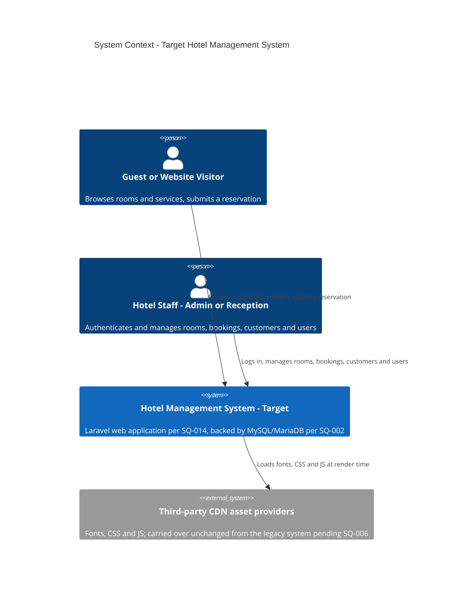
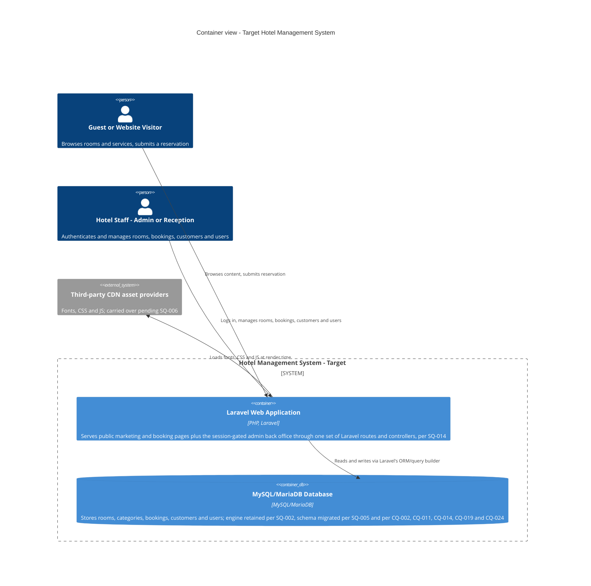
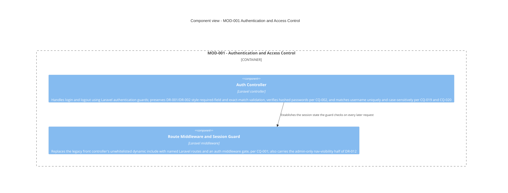
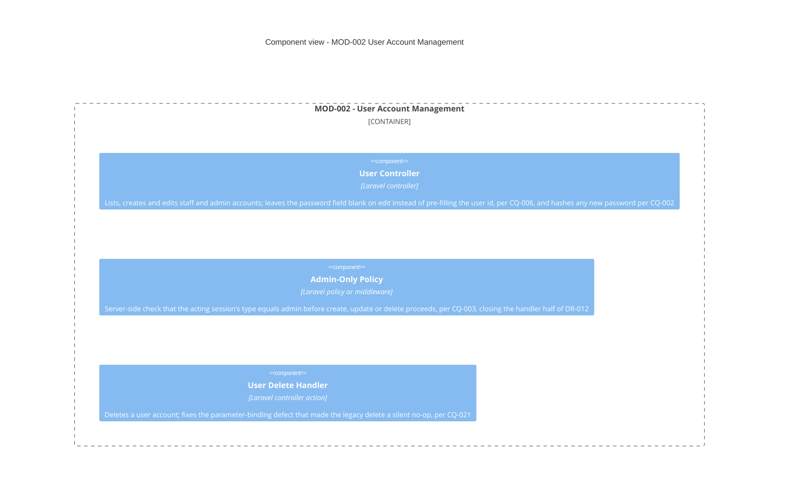
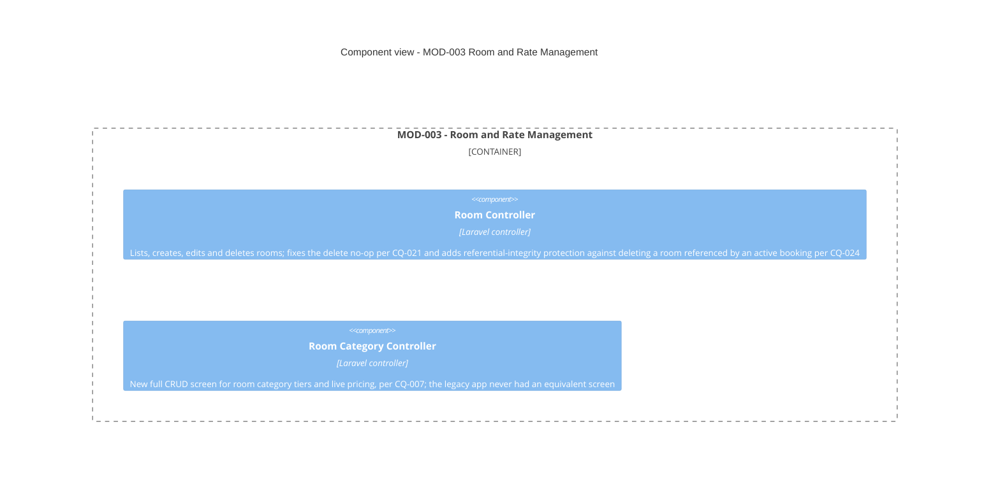
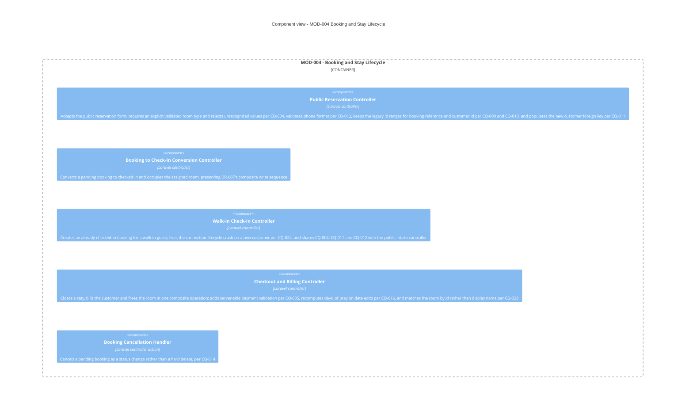
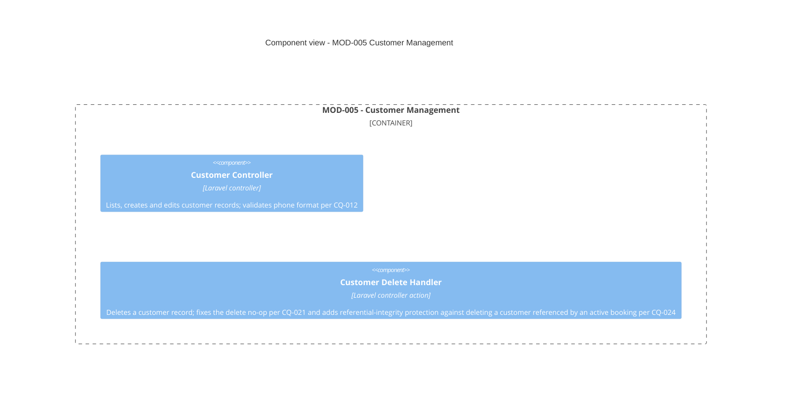
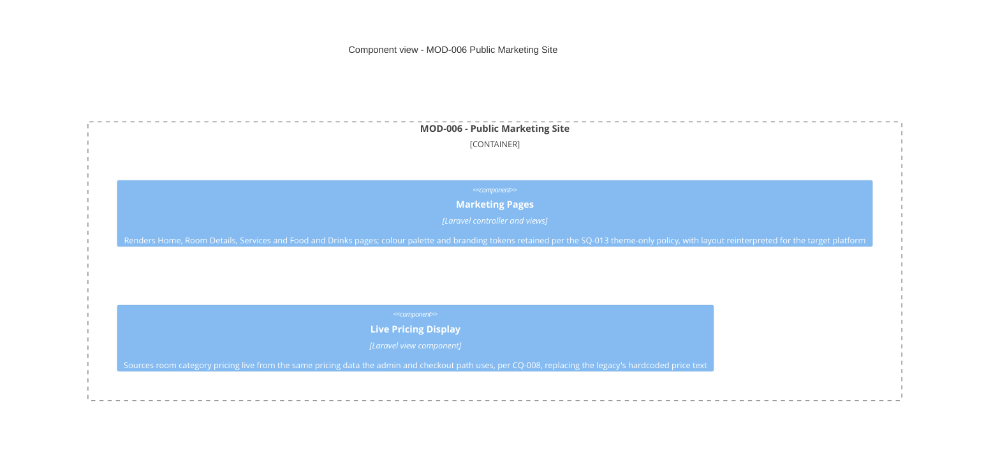
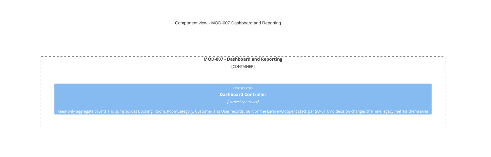

# Target Architecture: Hotel-Management-System

**Path analyzed:** /c/Users/MohamedRaashidBISTEC/OneDrive - BISTEC Global/Documents/specclaw project/Hotel-Management-System
**Date generated:** 2026-09-11
**Plugin version:** 0.6.10

**Blueprint status:** COMPLETE
**Module map:** CONFIRMED by Hafsa, 09-09-2026
**Source documents consumed:** architecture.md, module-map.md, decisions.md, clarifications.md, domain-model.md, pending-questions.md, rebuild-backlog.md
**Modules:** 7 active

<!--
  NOTE ON THIS COMMENT: never write a literal double-brace placeholder token
  inside this comment's own prose (not even to describe it) — the render
  step's template substitution is a first-occurrence string replace, and a
  token named here would be consumed by this comment instead of the real
  placeholder below. Refer to placeholders by section name instead.

  WHAT THIS DOCUMENT IS. The legacy side of a brownfield rebuild is richly
  documented — architecture.md, domain-model.md, module-map.md. The target
  side used to be scattered across decisions.md, ADRs, bootstrap-plan.md and
  the backlog, with nothing that showed the shape of the thing being built.
  This is that document: the target architecture, synthesised from decisions
  already made, in the same C4 vocabulary the legacy view uses so the two can
  be read side by side.

  IT IS DERIVED, NEVER DECIDED HERE. Every claim about the target rests on a
  recorded decision and cites it by id. Nothing in this file decides
  anything: a target element that no SQ/CQ/UQ sanctions is a gate violation
  and the render step refuses it, and a claim resting on a still-open
  question renders PROVISIONAL(<id>) rather than becoming a confident box in
  a diagram. Changing what this document says means answering a question in
  clarifications.md and re-running --resolve, never editing here.

  THE STATUS BLOCK above is bash-computed, never agent-drafted: the
  COMPLETE/PROVISIONAL verdict and the ids behind it, the warnings, and the
  inputs consumed. Recomputed from scratch every run.

  FULLY REGENERATED EVERY RUN. There is no hand-preserved zone anywhere in
  this file — unlike rebuild-backlog.md's human-added status notes. A
  re-run archives the prior version into .specclaw/analysis/archive/ and
  writes a new one wholesale, exactly like architecture.md and decisions.md.

  WRITTEN IN THE LEGACY REPO. This document is produced by
  /specclaw:bf-blueprint alongside every other analysis output and is never
  created or edited in the rebuild repo. It travels into the new repo as
  readability, never as something a verdict is computed from.

  ── Diagrams ─────────────────────────────────────────────────────────────

  Mermaid's native C4 diagram types: C4Context for the system context,
  C4Container for the container view, C4Component for one view per module.
  One Context diagram, one Container diagram, and one Component diagram per
  MOD-###, grouped under "## MOD-###" headings that mirror rebuild-backlog.md's
  own module grouping so the two documents line up module for module.

  A module whose target shape is entirely undecided gets a SINGLE
  PROVISIONAL placeholder box naming the question that blocks it — never an
  invented design. A speculative component diagram is worse than an empty
  one: it reads as a plan.

  ── The legacy-to-target mapping table ──────────────────────────────────

  One row per legacy container/component from architecture.md. Four columns:

    | Legacy element | Target element | Sanctioning decision | Status |

  Status is one of:
    DECIDED               — the target element rests on a recorded decision
    PROVISIONAL(<id>)     — it rests on a question still open
    RETIRED-BY-DECISION   — a decision explicitly drops this legacy element,
                            and the cited id is that decision

  EVERY ROW CITES SOMETHING. A target element with no sanctioning citation
  and no PROVISIONAL/RETIRED marker is a gate violation, and the render step
  fails the run naming the row. That check is the whole point of the table:
  it is the one place where "what we are building" is forced to line up,
  element by element, with "what somebody actually decided".
-->

## Target Overview

The rebuilt Hotel Management System is a web application (SQ-001) implemented on PHP with a modern framework, Laravel, including Laravel's own data-access/ORM approach (SQ-014). It replaces the legacy's un-frameworked, directory-split PHP application (`homepage/` and `admin/`, sharing raw `mysqli` connections) with a single Laravel codebase whose routing, controllers and Eloquent-style data access absorb both the public marketing/booking site and the session-gated admin back office. The two human actors carry over unchanged from `architecture.md`'s System Context (L1): an anonymous **Guest / Website Visitor** who browses and books, and **Hotel Staff** (admin or reception) who run day-to-day front-desk operations — no decision changes who interacts with the system, only how it is built underneath them.

The seven active modules from `module-map.md` (MOD-001 through MOD-007) map directly onto this rebuild: MOD-001 (Authentication & Access Control) and MOD-002 (User Account Management) together replace the legacy's ad hoc front-controller/session-gate and user-CRUD handlers with real authentication and authorization (SQ-004), closing the router's unwhitelisted dynamic include (CQ-001), hashing passwords (CQ-002), and adding the server-side admin-only check the legacy UI-only gate never had (CQ-003). MOD-003 (Room & Rate Management) gains a wholly new capability with no legacy equivalent — full CRUD for room categories and their live pricing (CQ-007) — alongside fixed delete handlers (CQ-021) and new referential-integrity checks (CQ-024). MOD-004 (Booking & Stay Lifecycle) remains the central transactional module, now populating an explicit `customer_id` foreign key instead of matching by phone (CQ-011), rejecting unrecognized room types rather than silently defaulting (CQ-004), and fixing several defects the legacy code shipped with (CQ-005, CQ-016, CQ-022, CQ-023). MOD-005 (Customer Management) and MOD-007 (Dashboard & Reporting) carry forward largely as-is, sanctioned by the general stack decision (SQ-014), with the same delete-and-integrity fixes MOD-003 receives (CQ-021, CQ-024). MOD-006 (Public Marketing Site) keeps the legacy's colour palette and branding tokens under the decided theme-only fidelity policy (SQ-013) while reinterpreting layout for the target platform, and now sources its displayed pricing live from the same data the admin/checkout path uses (CQ-008) rather than hardcoded marketing text.

Persistence stays on the legacy engine family: MySQL/MariaDB is retained rather than replaced (SQ-002), and all existing production data is migrated rather than left behind (SQ-005). Hosting is decided as cloud-hosted and single-tenant (SQ-003).

Several things this document cannot yet state with confidence, because no decision addresses them: the UI framework or component library the front end will actually use (SQ-006), the browser/device/OS support matrix (SQ-008), non-functional performance targets (SQ-010), and day-to-day operational requirements such as backup, monitoring and SLAs (SQ-011). Two further custom questions are open and out of scope for this architecture as drawn: whether an offline mode is ever required (UQ-001) and whether a companion mobile app is ever built (UQ-002) — the diagrams below assume neither, since nothing has decided otherwise. Every one of these is rendered as `PROVISIONAL(<id>)` wherever this document would otherwise need to assert something concrete about it, rather than guessed.

Two module-map.md facts are carried through unresolved by this document, because resolving them is not this document's job: MOD-001 and MOD-002 declare a mutual dependency on each other (`module-map.md`'s own "Depends on" fields, and independently confirmed by `/specclaw:bf-rebuild-plan`'s dependency-rank computation failing to converge) — authentication needs to read the `users` table MOD-002 owns, while MOD-002's screens need a session MOD-001 provides to be reachable at all. This blueprint groups and diagrams both modules exactly as `module-map.md` declares them, without picking one to go first.

## Target Stack, Persistence, Hosting and Auth

<!--
  Four short subsections, every claim carrying the id of the decision that
  sanctions it, or rendering PROVISIONAL(<id>) when the question is open.
  These are the four things every downstream reader — /specclaw:bf-bootstrap
  most of all — needs stated in one place.
-->

### Stack

The target backend is PHP with a modern framework, Laravel, including Laravel's own data-access/ORM approach — decided in SQ-014. This settles routing (replacing the legacy's unwhitelisted `?page=` dynamic include, per CQ-001), controllers, request validation, and the persistence-access pattern (replacing the legacy's ad hoc, duplicated `mysqli` connections with Laravel's ORM/query builder). SQ-014 does not settle the front-end rendering technology — whether the UI is server-rendered Blade views, a separate JS framework, or a component library — that question is SQ-006, still open. This document therefore makes no claim about, and draws no component for, any client-side framework: PROVISIONAL(SQ-006).

### Persistence

The database engine is retained as MySQL/MariaDB rather than replaced — decided in SQ-002 — and all existing production data is migrated into the rebuilt schema rather than left behind — decided in SQ-005. The schema itself changes in several decided ways: the `password` column is widened/replaced to hold a real hash (CQ-002); `booking` gains an explicit `customer_id` foreign key replacing phone-based application-level matching (CQ-011); `booking` gains a cancelled/soft-delete status so cancellations remain queryable (CQ-014); `users.username` gains a `UNIQUE` constraint (CQ-019); and both the Room and Customer delete paths gain referential-integrity protection against an active booking still referencing them (CQ-024).

### Hosting

The deployment model is cloud-hosted, single-tenant — decided in SQ-003. No decision yet states the specific compute/runtime shape (managed PaaS, containers, VM), backup cadence, monitoring, or SLA targets — those are operational requirements, SQ-011, still open: PROVISIONAL(SQ-011). See Deployment View below.

### Auth

Real authentication and authorization, sized to the target platform, is decided in SQ-004 — explicitly covering both CQ-002 (password hashing via `password_hash`/`password_verify`) and CQ-003 (a real server-side admin-only check on User Management handlers, closing the gap where the legacy UI hid the "Users" nav link but never checked `login_type` in the handlers themselves) together. Login further adopts a `UNIQUE` constraint on `username` and drops the legacy's unreachable "exactly one row" check (CQ-019), while preserving case-sensitive username matching for behavioral parity with the legacy `===` recheck (CQ-020). Every state-changing form/handler pair gains CSRF protection, which the legacy app has nowhere (CQ-015).

## System Context

Both external human actors carry forward unchanged from `architecture.md`'s System Context (L1) — no decision has been made that adds, removes, or redefines an actor. The target system itself is named as one box because SQ-001 decides the target platform is a web application and SQ-014 decides its stack is PHP/Laravel with MySQL/MariaDB persistence (SQ-002); together these two decisions are what license drawing this as a single system rather than several. The third-party CDN dependency (Google Fonts, w3schools, cdnjs — `architecture.md`'s System Context, L1) is carried forward as-is: no decision has addressed replacing it with vendored assets or a bundler, and its ultimate shape depends on the still-open UI framework/component-library question, PROVISIONAL(SQ-006).

## Containers

The legacy's two independently-entered containers, Public Website and Admin Back Office, are unified into one Laravel Web Application container. No decision calls for splitting the rebuild into separate deployable services, and SQ-014's decision that the backend is "PHP + a modern framework (Laravel), including its data-access/ORM approach" is naturally read as a single Laravel application with route groups and middleware distinguishing public from admin traffic — the same role the legacy's directory split played, now enforced by Laravel's own router and auth middleware rather than by directory convention and an unwhitelisted dynamic include (CQ-001). The database container carries forward as MySQL/MariaDB per SQ-002, with all production data migrated per SQ-005. No container is drawn for a separate front-end/asset-build service, because no decision (SQ-006) yet says whether one is needed: PROVISIONAL(SQ-006). No container is drawn for a distinct data-access-layer service either — the legacy's Shared DB Connection component is absorbed into Laravel's own ORM/query builder, per SQ-014's explicit inclusion of "its data-access/ORM approach."

## Components by Module

## MOD-001 — Authentication & Access Control

MOD-001 owns no entities of its own; it references the User entity that MOD-002 owns purely to verify login credentials (`module-map.md`). Per `module-map.md`'s own dependency declaration, MOD-001 and MOD-002 are mutually dependent — this blueprint states that fact rather than resolving it, since it is a known open item for a human to settle in `module-map.md` itself, not something a target-architecture document should paper over. Route Middleware and Session Guard together replace both the legacy's session-existence check (`admin/sidebar.php`) and its unsanitized `include $page . '.php'` (`admin/index.php`), per CQ-001.

## MOD-002 — User Account Management

MOD-002 owns the User entity outright. As noted under MOD-001, it depends on MOD-001's session gate to be reachable at all, and MOD-001 in turn depends on MOD-002's User table to authenticate — the cycle is declared, not resolved, here. The Admin-Only Policy component is the direct fix for DR-012's enforcement gap, where the legacy hid the "Users" nav link but never checked `login_type` inside `admin/xuliuser.php` or `admin/delete_user.php` themselves.

## MOD-003 — Room & Rate Management

MOD-003 owns Room and RoomCategory and depends on no other module. The Room Category Controller is wholly new scope sanctioned by CQ-007 — the legacy only ever offered a hardcoded three-option list wherever a category needed to be chosen, with no CRUD screen anywhere.

## MOD-004 — Booking & Stay Lifecycle

MOD-004 owns Booking outright and references Room/RoomCategory (MOD-003) and Customer (MOD-005). It is the module carrying the largest number of decided defect fixes, because it is where the legacy's composite-write flows (booking, check-in, checkout) live end to end (DR-006 through DR-011).

## MOD-005 — Customer Management

MOD-005 owns Customer outright and depends on no other module. Its own create-customer path independently regenerates the DR-004 customer id and runs the DR-005 phone-dedup check, the same mechanism MOD-004's flows use — the rebuild keeps these unified in shared application logic rather than the legacy's two independently-coded copies.

## MOD-006 — Public Marketing Site

MOD-006 owns no entities and references none directly, since the legacy pages issue no database query at all today. The legacy's second, decorative room-availability search widget on the homepage — which posted nowhere in-app — is dropped rather than implemented, per CQ-013.

## MOD-007 — Dashboard & Reporting

MOD-007 owns no entities; it reads across Booking (MOD-004), Room/RoomCategory (MOD-003), Customer (MOD-005) and User (MOD-002) for read-only counts, exactly as the legacy's nine `admin/counters/*.php` fragments do today. No decision revises the metrics themselves — only the implementation stack changes.

## Legacy → Target Mapping

| Legacy element | Target element | Sanctioning decision | Status |
|---|---|---|---|
| Public Website | Laravel Web Application - public routes and views | SQ-001, SQ-014 | DECIDED |
| Admin Back Office | Laravel Web Application - admin routes, session-gated | SQ-001, SQ-014, SQ-004 | DECIDED |
| MySQL/MariaDB Database | MySQL/MariaDB Database - retained engine, migrated schema | SQ-002, SQ-005 | DECIDED |
| Marketing Pages | Marketing Pages component (MOD-006) plus Live Pricing Display | SQ-013, CQ-008, CQ-013 | DECIDED |
| Public Booking | Public Reservation Controller (MOD-004) | CQ-011, CQ-004, CQ-009, CQ-010, CQ-012, CQ-015 | DECIDED |
| Front Controller & Layout | Route Middleware and Session Guard (MOD-001) | CQ-001, SQ-004 | DECIDED |
| Authentication | Auth Controller (MOD-001) | SQ-004, CQ-002, CQ-019, CQ-020 | DECIDED |
| Dashboard | Dashboard Controller (MOD-007) | SQ-014 | DECIDED |
| Room Management | Room Controller (MOD-003) | CQ-021, CQ-024 | DECIDED |
| Booking Management | Booking to Check-In Conversion Controller and Booking Cancellation Handler (MOD-004) | CQ-014, CQ-015 | DECIDED |
| Check-In Management | Walk-In Check-In Controller (MOD-004) | CQ-022, CQ-016 | DECIDED |
| Check-Out Management | Checkout and Billing Controller (MOD-004) | CQ-005, CQ-023 | DECIDED |
| Customer Management | Customer Controller and Customer Delete Handler (MOD-005) | CQ-021, CQ-024, CQ-012 | DECIDED |
| User Management | User Controller, Admin-Only Policy and User Delete Handler (MOD-002) | CQ-003, CQ-006, CQ-021 | DECIDED |
| Shared DB Connection | Laravel ORM/query builder data-access layer | SQ-014 | DECIDED |

## Data Migration Approach

All existing production data is migrated rather than left behind — decided in SQ-005 — onto the retained MySQL/MariaDB engine (SQ-002), so this is an in-place schema migration rather than a cross-engine data conversion. Several decided schema/behavior changes require migration steps beyond a straight copy:

- **Passwords (CQ-002):** existing `users.password` values are stored as plaintext and cannot be converted into a `password_hash` value after the fact without the original plaintext. The exact cutover mechanism (force a password reset for every existing account vs. some other transitional approach) is an operational-requirements question that SQ-011 has not yet answered — PROVISIONAL(SQ-011).
- **Username uniqueness (CQ-019):** any pre-existing duplicate `username` rows must be identified and reconciled before the new `UNIQUE` constraint can be applied; the legacy's "exactly one row" login check being unreachable today does not guarantee no duplicates exist in stored data.
- **Customer foreign key (CQ-011):** existing `booking` rows have no `customer_id` column; migration must backfill it by the same phone-based matching the legacy used, one time, before the new foreign-key-based lookup fully replaces phone matching going forward.
- **Cancelled/soft-delete status (CQ-014):** this is a pure schema addition (a new status value/soft-delete marker) — no existing row needs converting, since the legacy always hard-deleted cancellations.
- **Referential integrity (CQ-024):** the new checks apply going forward to delete operations; no migration action is required against already-stored data.

## Deployment View

The target is cloud-hosted and single-tenant — decided in SQ-003 — with a single Laravel application (SQ-014) and a retained MySQL/MariaDB database (SQ-002), most plausibly a managed database service given the single-tenant cloud model, though no decision names a specific provider or managed-vs-self-hosted choice. Beyond that, several deployment-relevant questions remain open and are not asserted here:

- The specific compute/runtime shape (managed PaaS, containers, VMs), backup cadence, monitoring and SLA targets are operational requirements, SQ-011, not yet decided — PROVISIONAL(SQ-011).
- The browser/device/OS support matrix that would inform any CDN/asset-delivery or caching strategy is SQ-008, not yet decided — PROVISIONAL(SQ-008).
- Non-functional targets (latency, throughput, concurrency) that would inform sizing are SQ-010, not yet decided — PROVISIONAL(SQ-010).
- Whether an offline mode (UQ-001) or a companion mobile app (UQ-002) is ever required is undecided; this deployment view assumes a single cloud-hosted web application serving browser clients only, since nothing has decided otherwise.

## Open Questions

<!--
  Bash-computed from clarifications.md + decisions.md: every blocking
  question still unanswered, and what it holds PROVISIONAL in this document.
  Answer these with /specclaw:bf-clarify (then --resolve) and re-run
  /specclaw:bf-blueprint — the markers clear by regeneration alone.
-->

None. Every blocking question this blueprint rests on has a recorded decision, and the module map is confirmed — which is why the status above reads COMPLETE.
